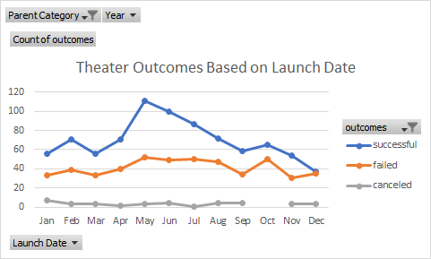
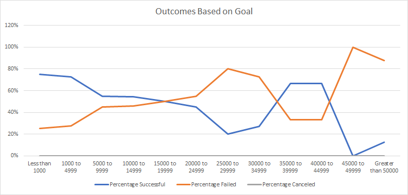

# Kickstarting with Excel

## Overview of Project

### Purpose
The analysis will inform goal-setting setting strategy for a UK based client looking to understand how her previous fundraising effort compared to others in a similar industry.

## Analysis and Challenges

### Analysis of Outcomes Based on Launch Date
The summer months (May, June & July) see the highest volume of successful theater fundraising campaigns according to the data available for analysis. The frequency of failed fundraising campaigns is relatively steady yet when comparing successful to failed campaigns, the end of the year (October, November & December) become more challenging for theater fundraisers. In fact, failed campaigns almost equal successful campaigns in December.

Chart below for reference.

### Analysis of Outcomes Based on Goals
The analysis looked solely at plays data for the visual. The chart was built to have a reference to the subcategory so it is flexible to adjust for future analysis. 

For plays the data would suggest that in aggregate the large the goal amount for a kick starter campaign, the less likely it is going to succeed or reach its goal. The inflection point from a higher likelihood of success to a higher likelihood of failure is around the $15,000 to $19,999 range. Keeping a kickstarter campaign below this threshold increases ones chances of success.

Chart below for reference.

### Challenges and Difficulties Encountered
One challenge was making the charting showcasing the rates of success by goal level to be flexible for other projects in the future. Re-writing the formulas to allow for duplicating the analysis was worth the effort. This addresses a future challenge for someone that may have access to this resource, hard-typing the sub-category into each formula leaves room open for error.

## Results

- **What are two conclusions you can draw about the Outcomes based on Launch Date?**
*Campaigns launched in the summer months have the greatest success rate for theater fundraisers. Campaigns launched at the end of the year have a greater likelihood for failure.*

- **What can you conclude about the Outcomes based on Goals?**
*Generally, the smaller the funraising goal the more likely a play is to be successful in reaching the goal. A clear majority of successful fundraisers for plays are for goals less than $20,000 which account for 97% of all successful plays in the dataset.*

- **What are some limitations of this dataset?**
*The dataset is only at a campaign level, rather than a dontation level. Therefore it is challenging to perform analysis that is useful to a client if they are the middle of a fundraising effort to understand how they are performing in comparison. This extra level of data could help a client understand if they should cancel the campaign early or keep going.*

- **What are some other possible tables and/or graphs that we could create?**
*Looking at the ratio to successful versus failed or canceled campaigns would give a better understanding of success while removing seasonality that may be inherent in the dataset. None of the questions focused on the Staff_Pick field which could provide a separate layer of analysis to see what types of fundraising campaigns are likely to be selected for this Staff Pick and if that has a higher likelihood of fundraising success.*